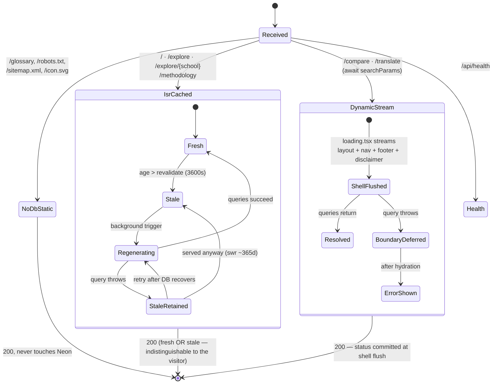
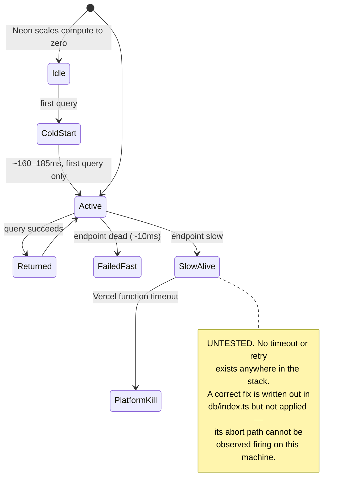
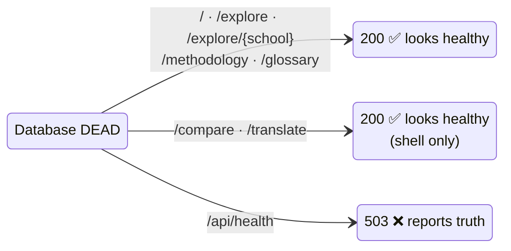
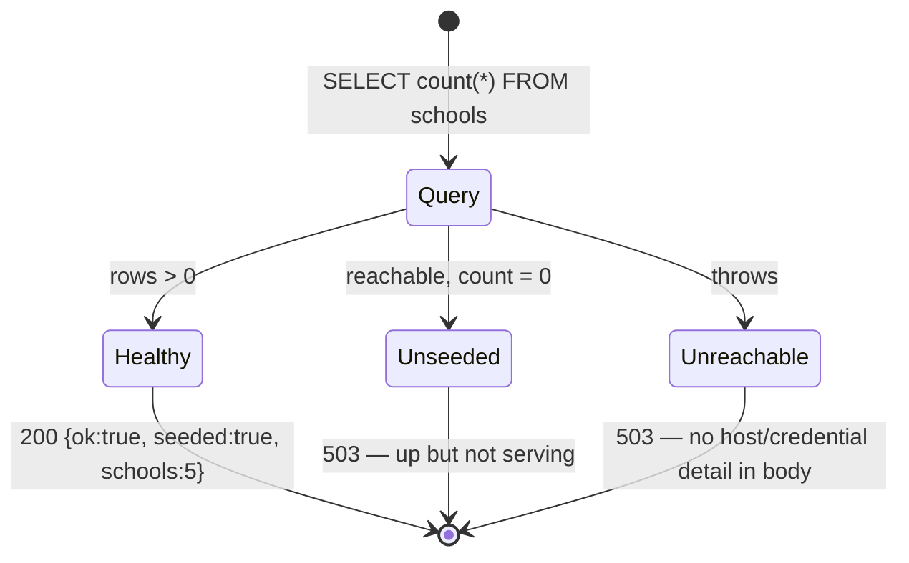
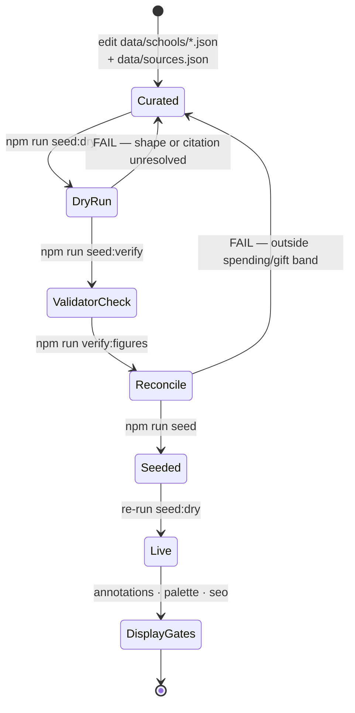
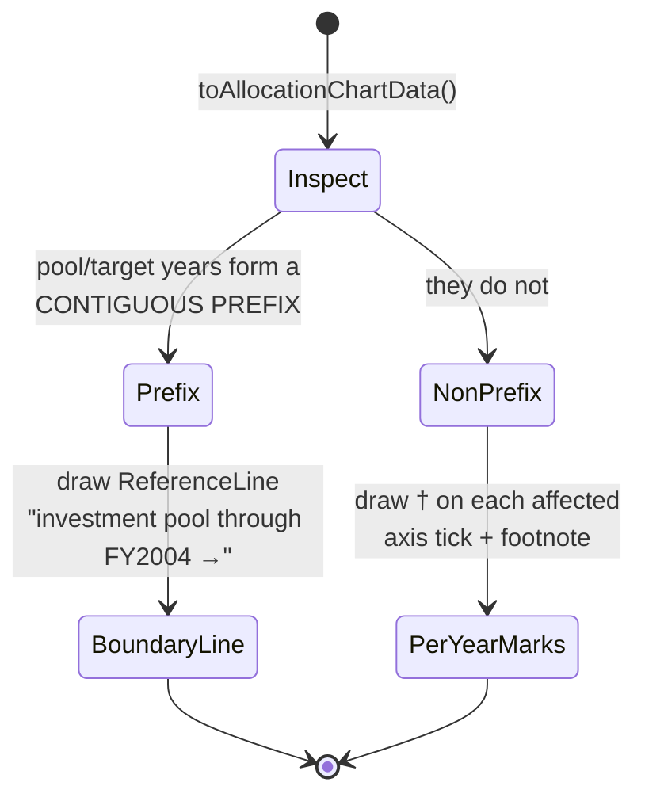
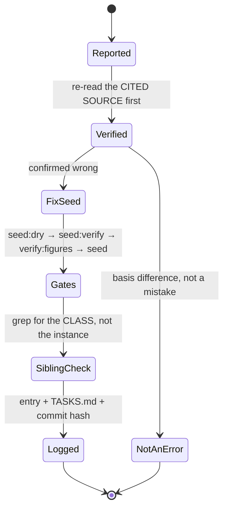
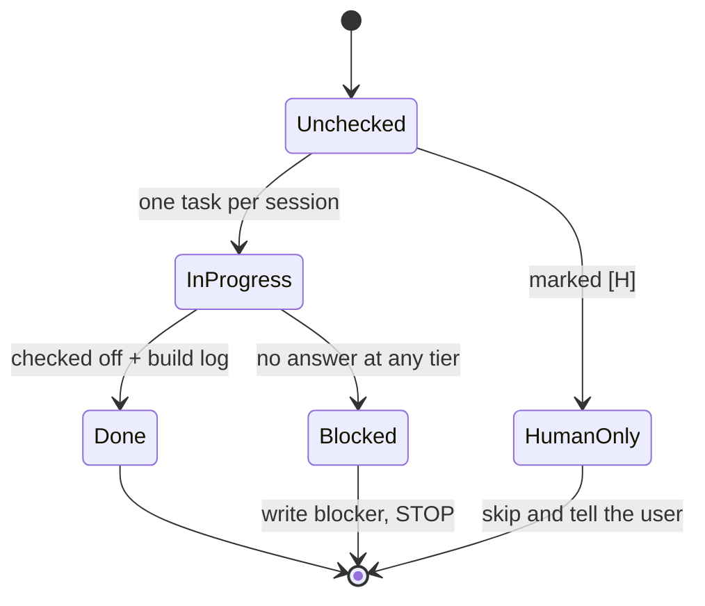
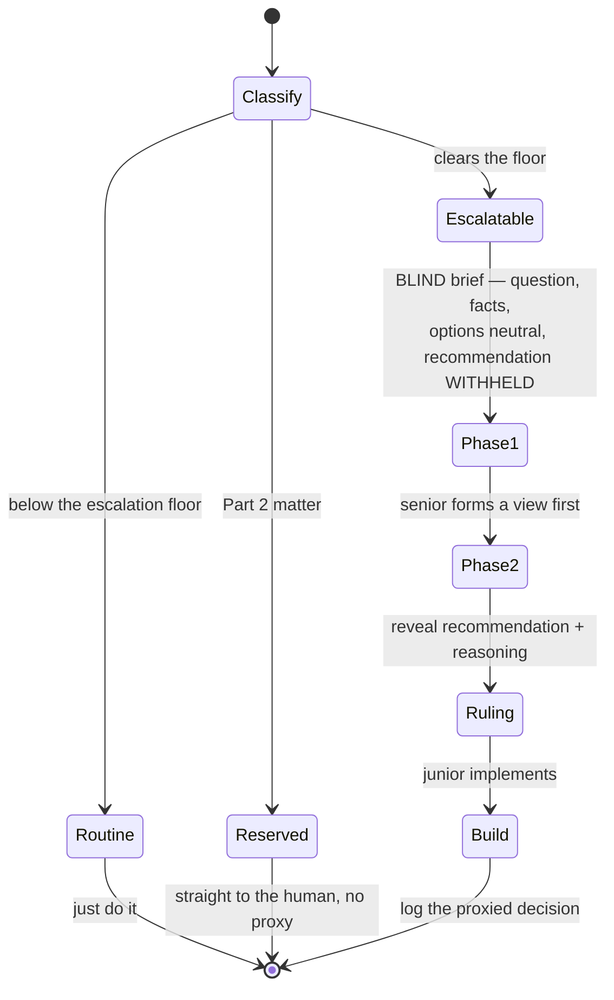
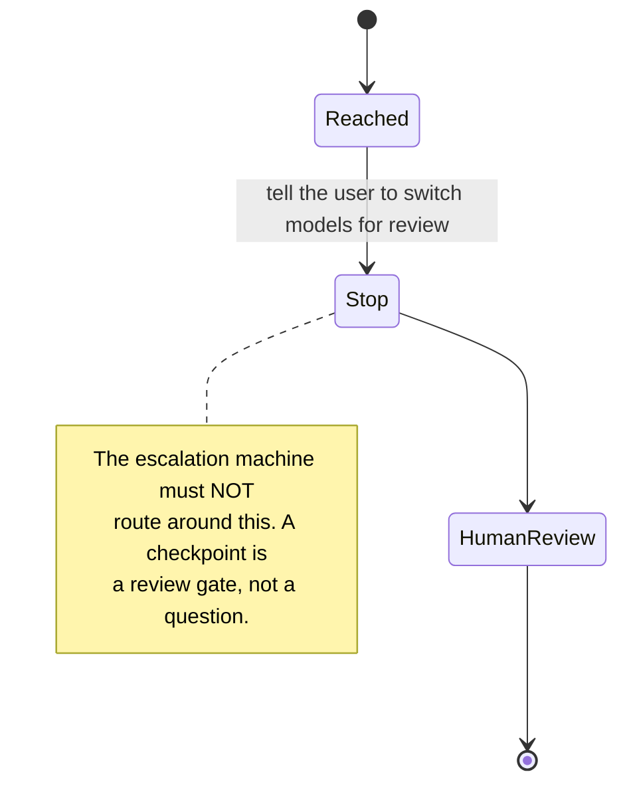

# State machines

Written 2026-08-11 by mapping the codebase with six parallel agents, then
adversarially verifying every state and transition against source. **Every state
below carries a `file:line` or a measurement.** Anything that could not be found
in the source is marked `INFERRED` and stays marked.

Forty-plus distinct machines were mapped. This document keeps the **ten that a
person actually needs**, grouped into the four subsystems the site really has:

| Subsystem | What it decides | Coupled to |
|---|---|---|
| **Render** | what HTTP status and HTML a visitor gets | almost nothing — that is the point |
| **Data** | what numbers exist and whether they are allowed to ship | Chart (by data *shape*) |
| **Chart** | what the picture *asserts* to a reader | Data |
| **Governance** | which transitions humans have permanently closed | all three |

The single most important structural fact: **the render subsystem is deliberately
decoupled from the data subsystem.** That is the site's best resilience property
and its worst observability property, and it is the root of most findings below.

---

## 1. Request → render

The central machine. Three genuinely different paths, not two.

**States and evidence**

| State | Evidence | What the visitor sees |
|---|---|---|
| `NoDbStatic` | `src/app/glossary/page.tsx` — not `async`, zero DB imports, no `revalidate` | Full page. Immune to database state forever. |
| `IsrCached.Fresh` | `src/app/page.tsx:14` `revalidate = 3600` | Real figures |
| `IsrCached.StaleRetained` | measured: `x-nextjs-cache: STALE`, 200, DB dead | Last-good figures. **Nothing on screen says stale.** |
| `DynamicStream.ShellFlushed` | `src/app/loading.tsx` | Site chrome + "Loading…" |
| `DynamicStream.ErrorShown` | `src/app/error.tsx` — client component | Friendly error + digest |

**Invariants**

- A visitor can never distinguish `Fresh` from `StaleRetained`. Deliberate.
- Once `ShellFlushed` is entered, **the HTTP status is committed** and cannot be
  changed by anything the page body does. This is not a detail — see §1a.
- `stale-while-revalidate` is ~365 days, so `StaleRetained` is effectively
  permanent during an outage. It survives revalidate expiry.

### 1a. The soft-404 this machine caused — found and fixed 2026-08-11

The status-commit invariant had a consequence nobody traced until the machines
were drawn. `src/app/explore/[school]/page.tsx` calls `notFound()` for an unknown
slug — correctly. But with `loading.tsx` present, the shell flushes **first**, so
by the time `notFound()` runs the 200 is already on the wire.

Measured on production before the fix:

| URL | Status | Body | Robots |
|---|---|---|---|
| `/explore/notaschool` | **200** ❌ | "Loading…" | `index, follow` **and** `noindex` — contradictory |
| `/definitely-missing` | 404 ✅ | 404 page | `noindex` |

Two 404 paths, two different status codes. Control experiment proved causation:
**404 with `loading.tsx` removed, 200 with it present.**

Fixed by closing the parameter set — `export const dynamicParams = false`, so the
router rejects unknown slugs *before* streaming starts. Both properties now hold
at once: unknown slug 404s, and an outage still yields 200-with-full-layout.

> **Why three tiers of testing missed it:** `verify:seo` tested an *unmatched
> path* (`/definitely-not-a-real-route-xyz`), which the router resolves before
> streaming and which was therefore never affected. It never tested an unknown
> *dynamic param*. A regression guard for exactly this now exists in
> `scripts/verify-seo.mjs`.

---

## 2. Database connection — including the state nobody has tested

`SlowAlive` is the one state in this whole document with **no evidence behind
it**, because it has never been produced. It is drawn precisely so it stays
visible. `src/lib/db/index.ts` carries the full reasoning, including the reverted
naive fix (`fetchOptions: { signal: AbortSignal.timeout(3000) }` puts *one*
signal in a static object, aborting 3s after module load and poisoning every
later query — measured, then reverted).

---

## 3. What an observer sees vs what is true

The monitoring machine exists because the render machine is *too* good at hiding
failure.

**Seven of eight routes return 200 during a total database outage.** Five serve
from the CDN; `/compare` and `/translate` joined them when `loading.tsx` began
flushing a shell before the failure. Only `/api/health` tells the truth.

Consequence, recorded in `conduct/RUNBOOK.md`: **point uptime checks at
`/api/health`, never at a page.** A page-level check is measuring the CDN, not
the application.

### 3a. Health probe

`Unseeded` is a distinct state on purpose: an empty database is *reachable* but
is not *working*, and conflating them is how a restore gets declared finished
too early.

---

## 4. Data pipeline — curation to live

`data/` is the source of truth; the database is derived. Losing Neon loses
nothing.

**What each gate does and does not catch** — the load-bearing distinction:

| Gate | Catches | Blind to |
|---|---|---|
| `seed:dry` | field shape, citation *resolves*, allocations ≈ 100 | whether the cited document **contains the figure** |
| `verify:figures` | transcription errors, via `MV[t] ≈ MV[t-1] × (1+return)` | errors that stay inside the plausible band |
| `verify:palette` | contrast below WCAG | meaning conveyed by colour alone |
| annotations | which disclosures render | whether the disclosure is *true* |

`verify:figures` is the one that catches a transposed digit, because a mistyped
number lands outside the 4–5.5% spending band immediately. Documented exceptions
must cite where the cause is recorded — never a bare silencing.

---

## 5. Chart disclosure — the honesty machine

The most subtle machine in the codebase. It decides **what the picture claims**,
and the data's *shape* — not its values — selects the branch.

**Why the branch exists at all.** A boundary line asserts *"everything before
this point is X."* That sentence is only true when the years form a contiguous
prefix. For a scattered set it is **a false statement drawn on a chart**, so the
code must fall back to per-year markers. Both branches are covered by unit tests
in `src/lib/__tests__/chart-data.test.ts` (MIT's pool years form a prefix; a
mid-series pool year refutes the prefix claim).

Related states in the same subsystem:

- **Coverage end** — `last disclosed: FYnnnn` when a school stopped reporting.
- **Basis break** — two measurement bases must never appear as one continuous
  series without a visible caveat *at the point of display* (Article 4).
- **Channel budget** — `fillOpacity` is already spent distinguishing
  target-vs-actual, so the second distinction must use position (a reference
  line). A chart has a finite number of visual channels and this machine tracks
  which are taken.
- **Accessibility relief** — `accessibilityLayer={false}` on all four charts;
  the table twin (`<th scope="row">`, caption, tabbable scroll container) is the
  substitute, not an extra.

---

## 6. Correction lifecycle

Two things this machine encodes that are easy to lose:

1. **Verify before changing.** The reporter may be wrong, or the disagreement may
   be a measurement-basis difference — the most common source of apparent
   contradictions in this data.
2. **Sibling check is mandatory.** Nearly every defect found in this project had
   a twin. Skipping this step is itself a recorded failure: the keyboard fix was
   applied to charts and missed three page tables on the same day the rule was
   written.

**Known dead transition:** `[*] → Reported` cannot fire from outside. There is no
contact address, no form, no issue link — a standing human ruling. Corrections
can currently only originate from the maintainer, which is exactly the weakness a
corrections process is meant to remove.

---

## 7. Governance — the machines that gate the others

### Task lifecycle

### Escalation — two-phase blind

The recommendation is withheld in Phase 1 so the senior forms an independent
view before being anchored. That ordering *is* the mechanism.

### Checkpoints are not escalatable

### Decision records — closing transitions permanently

A human ruling becomes durable memory by being written to `TASKS.md`, because no
conversation history survives between sessions. Three rulings recorded
2026-08-11 (benchmark licensing deferred, typeface unchanged, no contact line)
exist specifically so future sessions **stop re-raising them**. This machine's
whole purpose is to make certain transitions permanently unavailable.

---

## Coupling — where one machine silently decides another

| Edge | Mechanism | Consequence if forgotten |
|---|---|---|
| DB health **→** render | route segment config, not error handling | 7 of 8 routes hide a total outage |
| `loading.tsx` **→** observability | shell flush commits 200 early | fixed a blank page, degraded monitoring further — a recorded, accepted trade |
| `loading.tsx` **→** 404 semantics | status committed before `notFound()` | **caused the soft-404 in §1a** |
| Data *shape* **→** chart disclosure | prefix test in `chart-data.ts` | a new year can flip which disclosure renders — a truth change, not cosmetic |
| Annual refresh **→** prose | sitemap and JSON-LD derive automatically; **prose does not** | stale coverage claims in `blurbs.ts`, methodology page, PRD |
| Governance **→** everything | reserved matters and logged rulings | re-litigating closed decisions |

---

## What this exercise found

Drawing the machines was not documentation — it surfaced three defects that three
tiers of testing had missed:

1. **The soft-404** (§1a) — live on production, caused by a fix from six days
   earlier, now fixed with a regression guard.
2. **A self-contradicting comment** in `src/lib/db/index.ts`, whose first
   paragraph claimed "a 3s ceiling on every query" while the next line said "NO
   QUERY TIMEOUT". Leftover from the revert. A comment that lies about a safety
   property is worse than no comment.
3. **A stale count in the runbook** — it said five of eight routes return 200
   during an outage; its own later paragraph had already made that seven.

The common thread: each is a place where **two machines meet** and the seam went
unexamined. Single-component testing cannot find these.
